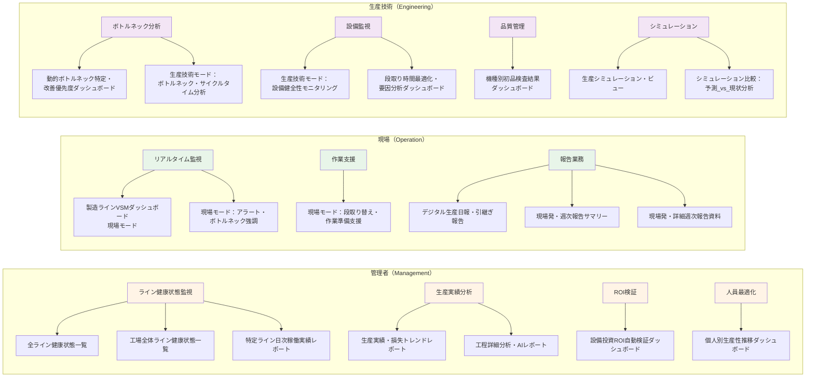
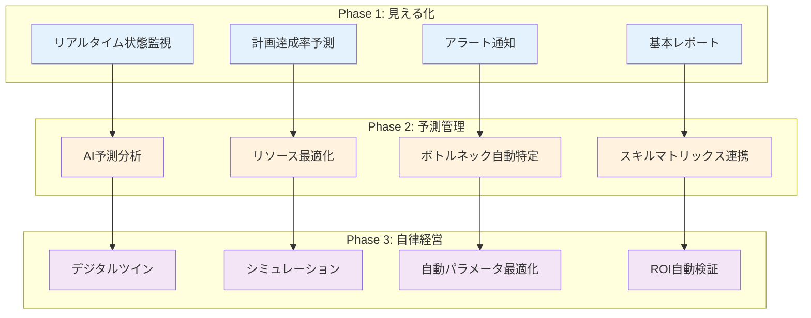
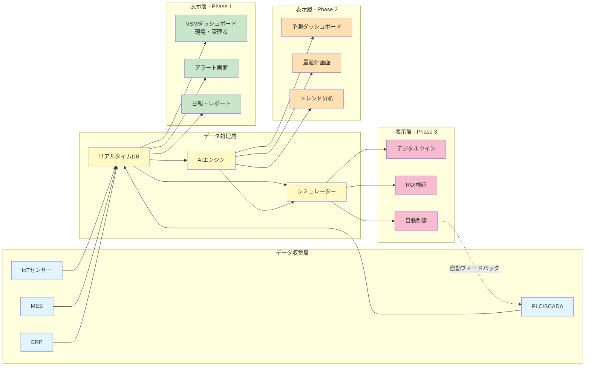
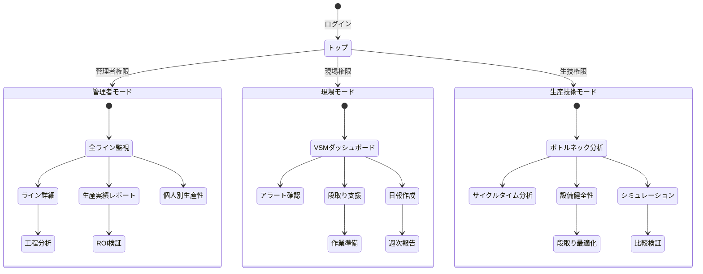

# VSM進化ロードマップ：HTML画面の関係性図解

## システム全体構造

```mermaid
graph TB
    subgraph "製造業DXロードマップ基盤"
        MD1[2026年最新動向ロードマップ.md]
        MD2[VSM進化ロードマップ.md]
    end

    subgraph "Phase 1: 予実同期と異常の見える化"
        P1M[管理者向け]
        P1O[現場向け]
        P1E[生産技術向け]

        P1M --> HTML1[製造ラインVSMダッシュボード<br/>管理者モード_1]
        P1M --> HTML2[全ライン健康状態一覧<br/>管理者]
        P1M --> HTML3[工場全体ライン健康状態一覧<br/>レベル1]
        P1M --> HTML4[特定ライン日次稼働実績<br/>レポート]

        P1O --> HTML5[製造ラインVSMダッシュボード<br/>現場モード]
        P1O --> HTML6[現場モード：アラート・<br/>ボトルネック強調]
        P1O --> HTML7[デジタル生産日報・<br/>引継ぎ報告]

        P1E --> HTML8[工程詳細分析・<br/>AIレポート]
        P1E --> HTML9[機種別初品検査結果<br/>ダッシュボード]
    end

    subgraph "Phase 2: リソース最適化と予測管理"
        P2M[管理者向け]
        P2O[現場向け]
        P2E[生産技術向け]

        P2M --> HTML10[製造ラインVSMダッシュボード<br/>管理者モード_2]
        P2M --> HTML11[個人別生産性推移<br/>ダッシュボード]
        P2M --> HTML12[生産実績・損失トレンド<br/>レポート]

        P2O --> HTML13[現場モード：段取り替え・<br/>作業準備支援]
        P2O --> HTML14[現場発・週次報告<br/>サマリー]
        P2O --> HTML15[現場発・詳細週次報告資料<br/>管理者向け]

        P2E --> HTML16[動的ボトルネック特定・<br/>改善優先度ダッシュボード]
        P2E --> HTML17[段取り時間最適化・<br/>要因分析ダッシュボード]
        P2E --> HTML18[生産技術モード：<br/>ボトルネック・サイクルタイム分析]
        P2E --> HTML19[生産技術モード：<br/>設備健全性モニタリング]
    end

    subgraph "Phase 3: 自律経営とデジタルツイン"
        P3M[管理者向け]
        P3E[生産技術向け]

        P3M --> HTML20[製造ラインVSMダッシュボード<br/>管理者モード_3]
        P3M --> HTML21[設備投資ROI自動検証<br/>ダッシュボード]

        P3E --> HTML22[生産シミュレーション・<br/>ビュー]
        P3E --> HTML23[シミュレーション比較：<br/>予測_vs_現状分析]
    end

    MD1 --> P1M
    MD1 --> P2M
    MD1 --> P3M
    MD2 --> P1O
    MD2 --> P2O
    MD2 --> P1E
    MD2 --> P2E
    MD2 --> P3E

    style MD1 fill:#e1f5ff
    style MD2 fill:#e1f5ff
    style P1M fill:#fff4e6
    style P1O fill:#e8f5e9
    style P1E fill:#f3e5f5
    style P2M fill:#fff4e6
    style P2O fill:#e8f5e9
    style P2E fill:#f3e5f5
    style P3M fill:#fff4e6
    style P3E fill:#f3e5f5
```

## ステークホルダー別画面マップ

## フェーズ別機能進化マトリックス

## HTML画面一覧と分類

### Phase 1: 予実同期と異常の見える化 (9画面)

#### 管理者向け (4画面)
1. **製造ラインVSMダッシュボード（管理者モード）_1** - 計画達成率のリアルタイム予測
2. **全ライン健康状態一覧（管理者）** - 全ライン状態の一覧監視
3. **工場全体ライン健康状態一覧（レベル1）** - 工場全体の俯瞰ビュー
4. **特定ライン日次稼働実績レポート** - ライン別詳細実績

#### 現場向け (3画面)
5. **製造ラインVSMダッシュボード（現場モード）** - タクトタイム可視化と進捗カウントダウン
6. **現場モード：アラート・ボトルネック強調** - 異常箇所の強調表示
7. **デジタル生産日報・引継ぎ報告** - 自動報告生成

#### 生産技術向け (2画面)
8. **工程詳細分析・AIレポート（管理者）** - 計画外停止のインパクト分析
9. **機種別初品検査結果ダッシュボード** - 標準時間の自動校正

---

### Phase 2: リソース最適化と予測管理 (10画面)

#### 管理者向け (3画面)
10. **製造ラインVSMダッシュボード（管理者モード）_2** - スキルマトリックス動的連携
11. **個人別生産性推移ダッシュボード** - 人員最適配置支援
12. **生産実績・損失トレンドレポート** - トレンド分析とサプライチェーンリスク予測

#### 現場向け (3画面)
13. **現場モード：段取り替え・作業準備支援** - 「次の一手」ナビゲーション
14. **現場発・週次報告サマリー（管理者宛）** - 自動進捗報告
15. **現場発・詳細週次報告資料（管理者向け）** - 詳細レポート自動生成

#### 生産技術向け (4画面)
16. **動的ボトルネック特定・改善優先度ダッシュボード** - ボトルネック工程の動的特定
17. **段取り時間最適化・要因分析ダッシュボード（生技）** - 段取り時間の最適化分析
18. **生産技術モード：ボトルネック・サイクルタイム分析** - 微小停止の自動クラスタリング
19. **生産技術モード：設備健全性モニタリング** - 設備予兆管理

---

### Phase 3: 自律経営とデジタルツイン (4画面)

#### 管理者向け (2画面)
20. **製造ラインVSMダッシュボード（管理者モード）_3** - リアルタイム収益性（PL）可視化
21. **設備投資ROI自動検証ダッシュボード** - 投資対効果の自動検証

#### 生産技術向け (2画面)
22. **生産シミュレーション・ビュー** - デジタルツインによる事前検証
23. **シミュレーション比較：予測_vs_現状分析** - サイバー・フィジカル・フィードバック

---

## データフロー図

## 画面遷移マップ

## 技術スタック共通要素

すべてのHTML画面は以下の共通技術スタックを使用：

- **フロントエンド**: TailwindCSS
- **フォント**: Inter（英数字）+ Noto Sans JP（日本語）
- **アイコン**: Material Symbols Outlined
- **カラーテーマ**:
  - Primary: #137fec（青）
  - Background Light: #f6f7f8
  - Background Dark: #101922
- **レスポンシブ対応**: モバイル・タブレット・デスクトップ
- **ダークモード**: 全画面対応

## まとめ

本システムは、**23個のHTML画面**で構成され、**3つのフェーズ**（予実同期 → 予測管理 → 自律経営）と**3つのステークホルダー**（管理者・現場・生産技術）のマトリックスで整理されています。

各画面は段階的に進化し、Phase 1の基本的な見える化からPhase 3のデジタルツイン・自律制御まで、一貫したVSM進化ロードマップに基づいて設計されています。
