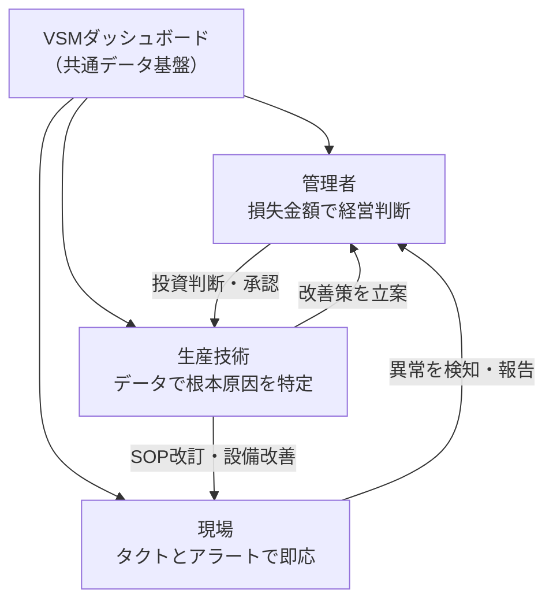

# VSM進化ロードマップ

**紙のVSMから、リアルタイムVSM、そしてデジタルツインへ。**

製造現場のバリュー・ストリーム・マッピング（VSM）を3段階で進化させ、自律型工場を実現するためのロードマップと、各フェーズのダッシュボード・プロトタイプを管理するリポジトリです。

---

## VSMの進化：3つのPhase

```
Phase 1                    Phase 2                    Phase 3
見える化                    AI予測                     自律制御
━━━━━━━━━━━━━━━━━━━━━━━━━━━━━━━━━━━━━━━━━━━━━━━━━━━━━━━━━━━━━━━━

  実績/検査結果/トラブル ┌─→  AI が検知             ┌─→  AI が検知
       │              │       │                   │       │
       ▼              │       ▼                   │       ▼
  リアルタイム表示     │  要因候補を提示           │  要因を特定
       │              │       │                   │       │
       ▼              │       ▼                   │       ▼
  乖離5%でアラート    │  対策を提案              │  シミュレーション実行
       │              │       │                   │       │
       ▼              │       ▼                   │       ▼
  ★ 人が見て判断      │  ★ 人が判断して実行       │  ★ 設備に直接フィードバック
                      │                           │
 ─────────────────────┘  ─────────────────────────┘
    データ蓄積が次へ繋がる      AI学習が次へ繋がる
```

| | Phase 1 | Phase 2 | Phase 3 |
|---|---|---|---|
| **テーマ** | 予実同期と異常の見える化 | AIによる予測管理とリソース最適化 | デジタルツインによる自律経営 |
| **AIの役割** | なし（データ収集と可視化） | 助言する（人が最終判断） | 自走する（設備に直接指示） |
| **一言で** | 「今どうなっている？」が見える | 「次に何が起きる？」がわかる | 「どうすれば最善か？」を試せる |
| **状態** | **作成中** | 設計済 | 設計済 |

---

## 3つのターゲット：誰が、何を見るか

すべてのダッシュボードは、**管理者・現場・生産技術**の3つの立場別に設計されています。同じデータ基盤を共有しながら、立場ごとに「見るべき数字」と「取るべきアクション」が異なります。



### 管理者（Management）

**「いくら損しているか」を金額で見て、最も効果的な手を打つ。**

- 全ラインの健康状態を俯瞰し、損失金額の大きいラインから対応
- 計画達成率のリアルタイム予測で残業要否を早期判断
- パレート分析で改善投資のROIを即座に算出

| Phase | 主な機能 | ダッシュボード数 |
|---|---|---|
| Phase 1 | 損失金額の可視化、着地予測、パレート分析 | 4画面 |
| Phase 2 | スキルマトリックス連携、損失トレンド分析 | 3画面 |
| Phase 3 | リアルタイムPL、プロダクトミックス最適化、ROI自動検証 | 2画面 |

### 現場（Operation）

**「今、計画通りか」を一目で確認し、異常があれば即座に行動する。**

- 目標タクト vs 実績タクトで自律的にスピード調整
- 「あと何個」のカウントダウンで達成感を生む
- アラートを見て1分以内に「見て→判断→行動」

| Phase | 主な機能 | ダッシュボード数 |
|---|---|---|
| Phase 1 | タクト監視、ボトルネック強調、アラート通知 | 2画面 |
| Phase 2 | 段取り替え支援、日報自動生成、週次報告自動化 | 4画面 |
| Phase 3 | 作業標準の自動切り替え、バイタルデータ安全管理 | ─（Phase 1・2画面に統合） |

### 生産技術（Engineering）

**「なぜ遅れたのか」をデータで突き止め、改善の根拠を作る。**

- AI分析レポートで設備の問題か人の問題かを切り分け
- 品種別ボトルネックの動的特定と改善優先度の決定
- 改善効果をVSMデータで前後比較し、定量的に証明

| Phase | 主な機能 | ダッシュボード数 |
|---|---|---|
| Phase 1 | 工程詳細分析、AIレポート、初品検査管理 | 2画面 |
| Phase 2 | 動的ボトルネック特定、微小停止検知、段取り時間最適化 | 4画面 |
| Phase 3 | What-Ifシミュレーション、予測vs現状比較 | 2画面 |

---

## リポジトリ構成

```
.
├── README.md                          ← このファイル
│
├── html/                              ← ダッシュボード（HTMLプロトタイプ）
│   ├── Phase1-予実同期と異常のリアルタイム見える化/
│   │   ├── 管理者向け/                   （4画面）
│   │   ├── 現場向け/                     （2画面）
│   │   └── 生産技術向け/                 （2画面）
│   ├── Phase2-AIによる予測管理とリソース最適化/
│   │   ├── 管理者向け/                   （3画面）
│   │   ├── 現場向け/                     （4画面）
│   │   └── 生産技術向け/                 （4画面）
│   └── Phase3-デジタルツインによる自律経営/
│       ├── 管理者向け/                   （2画面）
│       └── 生産技術向け/                 （2画面）
│
├── screenshots/                       ← ダッシュボードのスクリーンショット
│   └── （htmlと同じツリー構造、.png）
│
├── VSM進化ロードマップ：プロジェクトの進め方.md
│                                      ← 図解入りのPhase別プロジェクト説明
├── VSM進化ロードマップ：全ステークホルダー向け詳細定義.md
│                                      ← Phase×ターゲットの機能定義一覧
├── VSMダッシュボード活用ガイド：立場別ベストプラクティス.md
│                                      ← 管理者・現場・生技の使い方ガイド
└── 2026年2月最新動向に基づく自律型工場への変革：
    製造業DXとサイバーフィジカルシステムの統合ロードマップ.md
                                       ← 技術動向と変革の背景
```

**合計23画面のダッシュボード・プロトタイプ**（HTML + スクリーンショット）

---

## ダッシュボードの使い方

各HTMLファイルはブラウザで直接開けます。

```bash
# 例：管理者向けVSMダッシュボードを開く
open "html/Phase1-予実同期と異常のリアルタイム見える化/管理者向け/製造ラインvsmダッシュボード（管理者モード）_1.html"
```

---

## このプロジェクトの本質

> 熟練者の判断力をデータとして残し、全員が使えるようにする。
> 人を置き換えるのではなく、人の力を最大限に引き出すための基盤。

Phase 1で「今」を見える化し、Phase 2でAIが「次」を予測し、Phase 3でデジタルツインが「最善」をシミュレーションする。この3段階を通じて、VSMは「見える化ツール」から「利益を生む経営基盤」へ進化します。
