# VSM進化ロードマップ：プロジェクトの進め方

> **現場の「見える化」を、3段階で進化させる。**
> 紙のVSMから、リアルタイムVSM、そしてデジタルツインへ。

---

## 全体像：3つのPhaseと進化の流れ

```mermaid
graph LR
    subgraph Phase1["Phase 1：予実同期と異常の見える化"]
        P1A[計画 vs 実績の<br>リアルタイム表示]
        P1B[異常の即時検知<br>5%乖離アラート]
        P1C[損失金額の<br>自動算出]
    end

    subgraph Phase2["Phase 2：AIによる予測管理とリソース最適化"]
        P2A[AIによる<br>ボトルネック特定]
        P2B[日報の自動生成<br>報告業務ゼロ化]
        P2C[スキルマトリックス<br>人員最適配置]
    end

    subgraph Phase3["Phase 3：デジタルツインによる自律経営"]
        P3A[What-If<br>シミュレーション]
        P3B[設備投資ROIの<br>自動検証]
        P3C[サイバーフィジカル<br>フィードバック]
    end

    Phase1 -->|データ蓄積| Phase2 -->|学習・予測| Phase3

    style Phase1 fill:#e8f5e9,stroke:#2e7d32,stroke-width:2px
    style Phase2 fill:#e3f2fd,stroke:#1565c0,stroke-width:2px
    style Phase3 fill:#fce4ec,stroke:#c62828,stroke-width:2px
```

### Phaseごとの位置づけ

| | Phase 1 | Phase 2 | Phase 3 |
|---|---|---|---|
| **テーマ** | 予実同期と異常の見える化 | AIによる予測管理とリソース最適化 | デジタルツインによる自律経営 |
| **一言で** | 「今どうなっている？」が見える | 「次に何が起きる？」がわかる | 「どうすれば最善か？」を試せる |
| **核心技術** | リアルタイムデータ収集・可視化 | AI分析・予測モデル | シミュレーション・最適化エンジン |
| **ダッシュボード数** | 8画面 | 11画面 | 4画面 |
| **状態** | **作成中** | 設計済 | 設計済 |

---

## ステークホルダーの関係

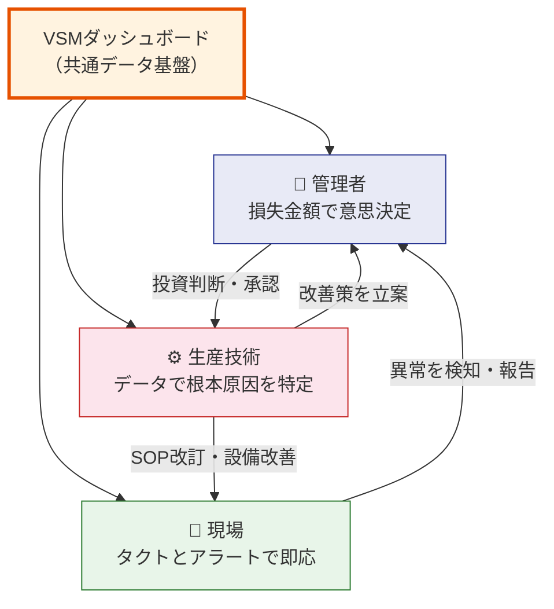

> **3者が同じデータを見て、同じ数字で会話する。** これがVSMダッシュボードの最も重要な価値。

---

## Phase 1：予実同期と異常の見える化

### 目指す姿

> **「今、計画に対してどうなのか」を全員がリアルタイムに共有し、即応できる体制を作る**

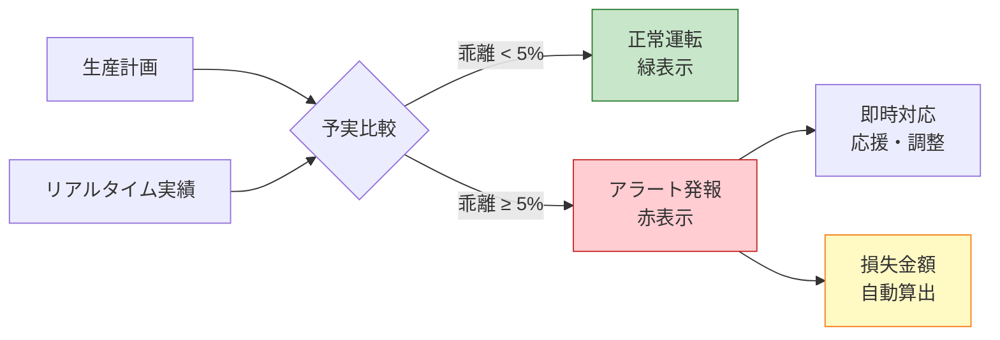

### Phase 1 で得られる価値

| 対象 | 何が変わるか | 具体例 |
|------|-------------|--------|
| **管理者** | 計画達成率をリアルタイム予測、損失を金額で把握 | 「Line A 停止中 → 損失 ¥1,250,000」で優先度を即判断 |
| **現場** | 目標タクト vs 現在タクトで自律的に調整 | 「あと何個」のカウントダウンで達成感 |
| **生産技術** | 計画外停止のインパクトを自動算出 | 標準時間(ST)を実績データで自動校正 |
| **共通** | 計画乖離5%でプッシュ通知 | 問題が大きくなる前に手を打てる |

---

### 管理者向けダッシュボード（4画面）

#### 工場全体ライン健康状態一覧

全ラインの稼働・注意・停止を一画面で俯瞰。損失金額の大きい順に対応優先度を判断する。

#### 全ライン健康状態一覧（管理者）

各ラインのスループット・直行率・仕掛品数・損失金額を比較。問題のあるラインをドリルダウンする起点となる。

#### VSMダッシュボード（管理者モード）

特定ラインのVSMフロー上で各工程の推定損失・遅延リスクを表示。AIサマリーが優先度順にアラートを整理する。

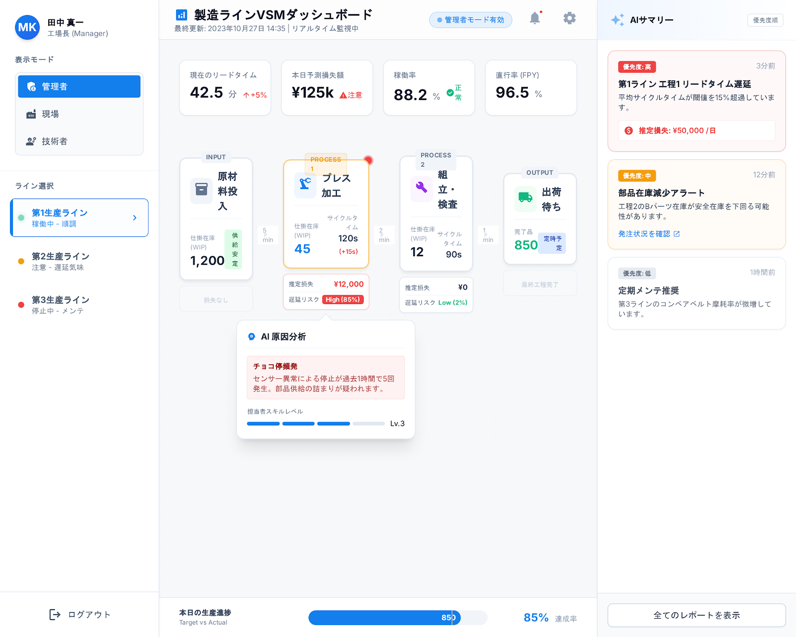

#### 日次稼働実績レポート

損失要因のパレート分析で「どこに投資すれば利益が戻るか」を定量的に判断する。

---

### 現場向けダッシュボード（2画面）

#### VSMダッシュボード（現場モード）

目標タクト vs 実績タクトを並置。仕掛品の過不足を色で直感的に把握する。

#### アラート・ボトルネック強調画面

ボトルネック工程をハイライト表示し、バッファ滞留を警告。段取り替え予告や部材不足のアラートを通知する。

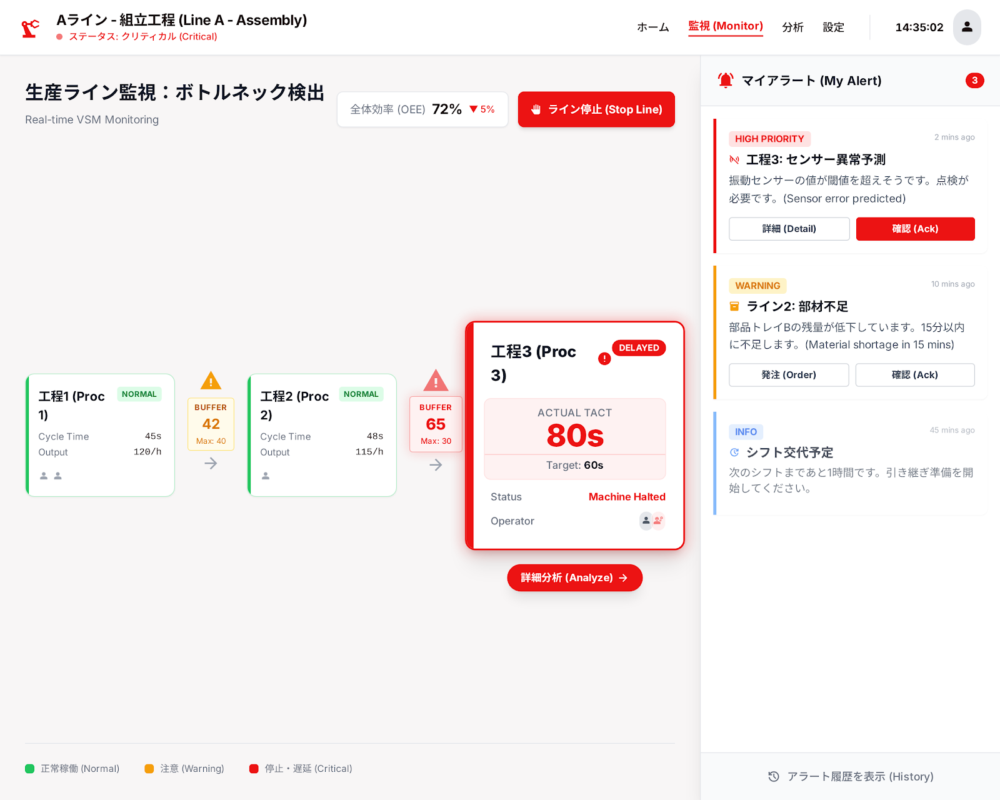

---

### 生産技術向けダッシュボード（2画面）

#### 工程詳細分析・AIレポート

損失コスト推移（30日）、AI分析レポート、スキルマップ、SOP動画を統合。設備の問題か人の問題かを切り分ける。

#### 機種別初品検査結果ダッシュボード

検査ステータス、詳細項目チェック、測定データグラフ、承認フローを一画面に統合。量産前の品質確保に使う。

---

## Phase 2：AIによる予測管理とリソース最適化

### 目指す姿

> **「ヒト・モノ・設備」の状態をAIが解析し、先回りして無駄を排除する**

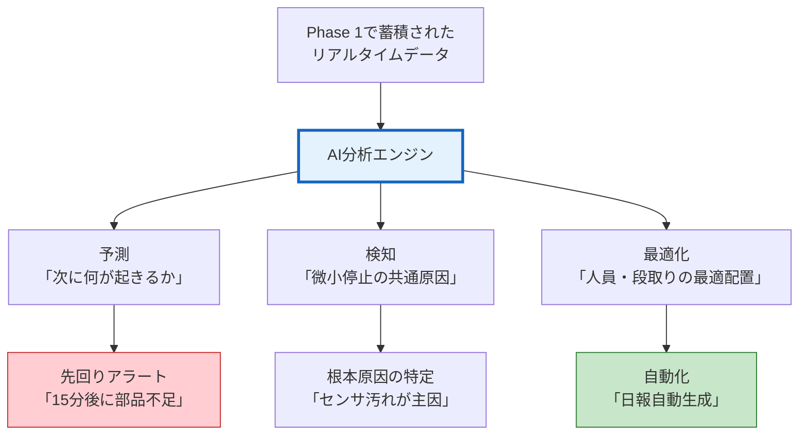

### Phase 2 で得られる価値

| 対象 | 何が変わるか | 具体例 |
|------|-------------|--------|
| **管理者** | スキルマトリックスと進捗の掛け合わせで高精度な着地予測 | ライン間の応援タイミングを最適指示 |
| **現場** | 「次の一手」をウェアラブルで通知、日報が自動生成 | 段取り替えカウントダウンで準備を最適化 |
| **生産技術** | 微小停止のクラスタリング、品種別ボトルネック特定 | 段取り時間の品種組み合わせ影響を分析 |

---

### 管理者向けダッシュボード（3画面）

#### VSMダッシュボード（管理者モード v2）

Phase 1に加え、AI予測による着地見込みとリソース最適配置の提案が統合される。

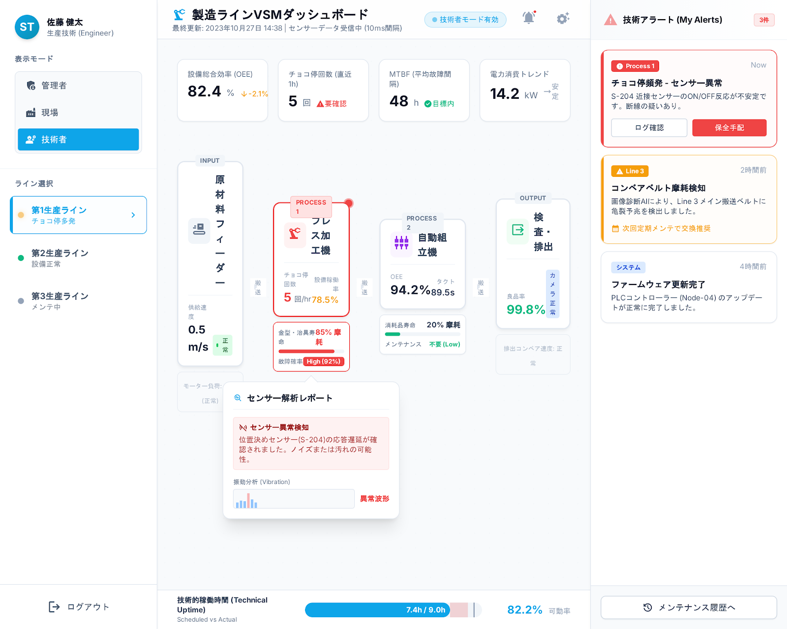

#### 個人別生産性推移ダッシュボード

メンバーの習熟度と生産性推移を可視化。教育投資の判断材料となる。

#### 生産実績・損失トレンドレポート

中長期の損失傾向を分析。改善施策の効果を時系列で検証する。

---

### 現場向けダッシュボード（4画面）

#### 段取り替え・作業準備支援

次の品番切り替えまでのカウントダウンを表示。部品準備や工具交換のタイミングを最適化する。

#### デジタル生産日報・引継ぎ報告

VSMのデータから日報を自動生成。タブレット入力の非生産的な時間を完全に撤廃する。

#### 週次報告サマリー（管理者宛）

現場から管理者への報告を自動集約。現場は報告作業から解放され、本来の仕事に集中できる。

#### 詳細週次報告資料（管理者向け）

週次のパフォーマンスを多角的に分析した詳細版レポート。

---

### 生産技術向けダッシュボード（4画面）

#### ボトルネック・サイクルタイム分析

品種ごとに変化するボトルネック工程を自動特定。設備改善の優先度を決定する。

#### 設備健全性モニタリング

人が気づけない数秒の微小停止を抽出し、共通原因をAIが特定する。

#### 動的ボトルネック特定・改善優先度ダッシュボード

リアルタイムでボトルネックの移動を追跡し、改善の優先度を提示する。

#### 段取り時間最適化・要因分析ダッシュボード

段取り時間の計画値と実績の差を分析。品種の組み合わせによる影響を特定して生管へ提案する。

---

## Phase 3：デジタルツインによる自律経営

### 目指す姿

> **「シミュレーション」が現場を動かし、未来の利益を最大化する**

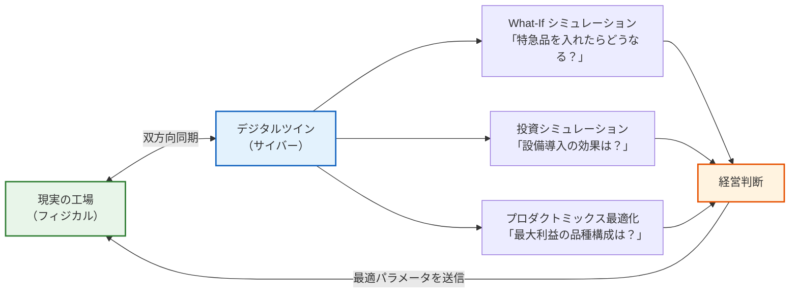

### Phase 3 で得られる価値

| 対象 | 何が変わるか | 具体例 |
|------|-------------|--------|
| **管理者** | 投資判断をシミュレーションで事前検証、リアルタイムPL可視化 | 利益率の高い品種構成を自動探索 |
| **現場** | 作業標準が品種に合わせて自動切り替え | バイタルデータで安全管理（疲労度検知） |
| **生産技術** | 特急品投入の影響をシミュレーション、設備パラメータの自動最適化 | 治具・工具の寿命を予兆管理 |

---

### 管理者向けダッシュボード（2画面）

#### VSMダッシュボード（管理者モード v3）

デジタルツインと連携し、シミュレーション結果に基づく経営判断を支援する最終形態。

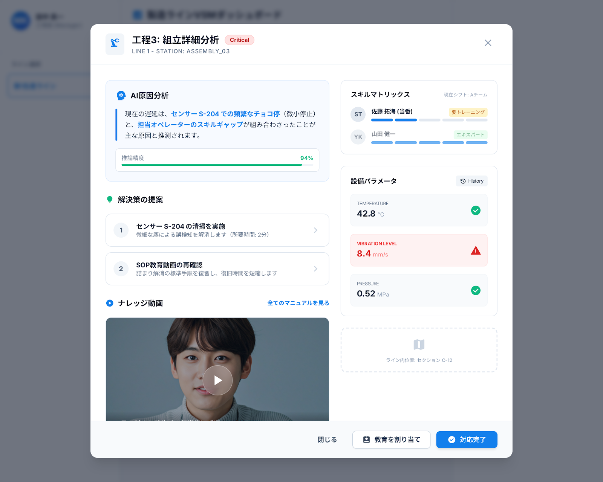

#### 設備投資ROI自動検証ダッシュボード

設備導入前後のデータを自動比較し、リードタイム短縮効果や投資回収期間をレポートする。

---

### 生産技術向けダッシュボード（2画面）

#### 生産シミュレーション・ビュー

デジタルツイン上で生産ラインの挙動を再現し、最適な稼働パラメータを探索する。

#### シミュレーション比較：予測 vs 現状分析

シミュレーション結果と現状を並べて比較。改善施策の効果を事前に定量評価する。

---

## データ駆動の改善ループ

3つのPhaseを通じて構築される改善サイクル：

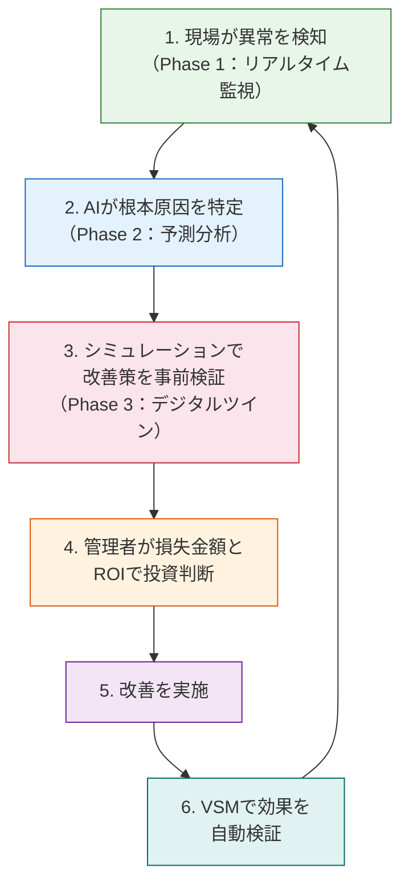

---

## ダッシュボード一覧

### Phase 1（8画面）── 現在作成中

| # | ダッシュボード名 | 対象 | 主な用途 |
|---|---|---|---|
| 1 | 工場全体ライン健康状態一覧 | 管理者 | 全ライン俯瞰・優先度判断 |
| 2 | 全ライン健康状態一覧 | 管理者 | ライン別KPI比較 |
| 3 | VSMダッシュボード（管理者モード） | 管理者 | 工程別損失・AIサマリー |
| 4 | 日次稼働実績レポート | 管理者 | パレート分析・投資判断 |
| 5 | VSMダッシュボード（現場モード） | 現場 | タクト監視・進捗確認 |
| 6 | アラート・ボトルネック強調 | 現場 | 異常検知・即時対応 |
| 7 | 工程詳細分析・AIレポート | 生産技術 | 根本原因分析・教育判断 |
| 8 | 機種別初品検査結果 | 生産技術 | 品質確保・承認フロー |

### Phase 2（11画面）

| # | ダッシュボード名 | 対象 | 主な用途 |
|---|---|---|---|
| 9 | VSMダッシュボード（管理者モード v2） | 管理者 | AI予測付き着地管理 |
| 10 | 個人別生産性推移 | 管理者 | 人材育成・配置判断 |
| 11 | 生産実績・損失トレンド | 管理者 | 中長期の改善効果検証 |
| 12 | 段取り替え・作業準備支援 | 現場 | 段取り最適化 |
| 13 | デジタル生産日報 | 現場 | 報告業務の自動化 |
| 14 | 週次報告サマリー | 現場 | 管理者向け自動報告 |
| 15 | 詳細週次報告資料 | 現場 | 詳細分析レポート |
| 16 | ボトルネック・サイクルタイム分析 | 生産技術 | 品種別ネック工程の特定 |
| 17 | 設備健全性モニタリング | 生産技術 | 微小停止の検知・分析 |
| 18 | 動的ボトルネック特定 | 生産技術 | リアルタイムのネック追跡 |
| 19 | 段取り時間最適化 | 生産技術 | 品種組み合わせの影響分析 |

### Phase 3（4画面）

| # | ダッシュボード名 | 対象 | 主な用途 |
|---|---|---|---|
| 20 | VSMダッシュボード（管理者モード v3） | 管理者 | シミュレーション連携の経営判断 |
| 21 | 設備投資ROI自動検証 | 管理者 | 投資効果の定量評価 |
| 22 | 生産シミュレーション・ビュー | 生産技術 | パラメータ探索・最適化 |
| 23 | シミュレーション比較 | 生産技術 | 予測 vs 現状の差分分析 |

---

## まずはPhase 1から

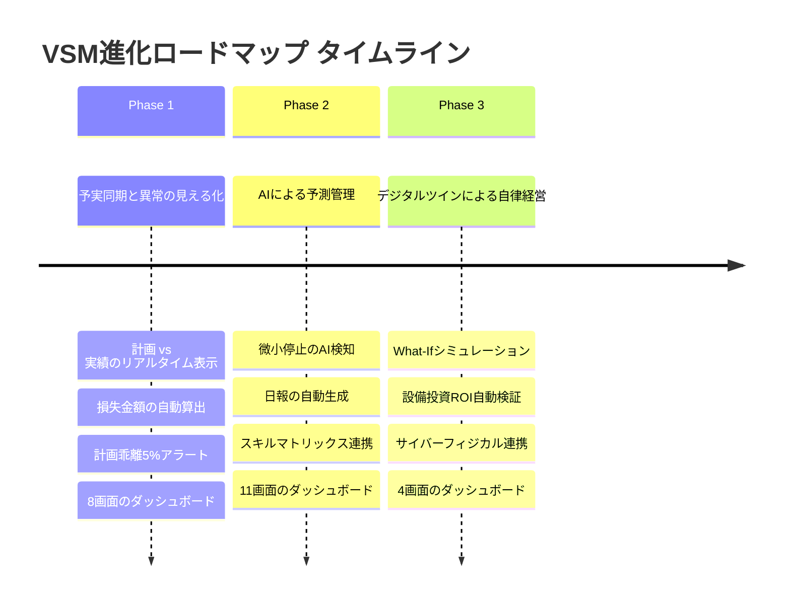

Phase 1を確実に立ち上げ、現場の全員が「計画に対して今どうなっているか」を自分の目で確認できる状態を作る。それが、Phase 2・Phase 3への最も確実な道筋となる。

> **熟練者の判断力をデータとして残し、全員が使えるようにする。**
> 人を置き換えるのではなく、人の力を最大限に引き出すための基盤。それがこのプロジェクトの本質です。
